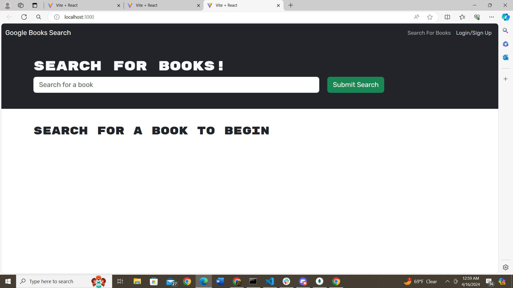

# StoryFinder

## Description

With this application, the user is able to create a profile and log in. Once logged in, the user is able to look up books, save them to their own collection and delete them if they wish.

## Table of Contents
- [Installation](#installation)
- [Usage](#usage)
- [Credits](#credits)

## Installation

This project was completed with start code by Xandromus in a repo called solid-broccoli. Once cloned, schemas had to be added in addition to overhauling the front-end API's with queries and mutations.

## Usage

By starting with a basic skeleton, you then add several components. 

## Credits

Code that was referenced was by Xandromus. His starter-code github repo is below: 

https://github.com/coding-boot-camp/solid-broccoli

https://github.com/heidiwu3388/Book-Search-Engine

Old projects I have completed helped a lot with this project as well as the git lab repo:
https://git.bootcampcontent.com/University-of-Minnesota/UofM-VIRT-FSF-PT-10-2023-U-LOLC-ENTG/-/tree/main/21-MERN/02-Challenge?ref_type=heads
